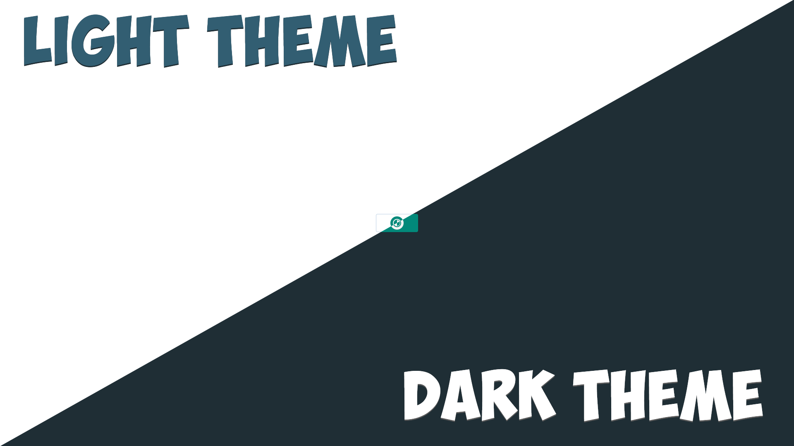

# changeTheme
An example of the implementation of switching the theme of the site, with the preservation of the choice. Used: HTML5, CSS3, JavaScript.

## Statistics

## Demo

## Contact

Discord: Kvanzi#9045
